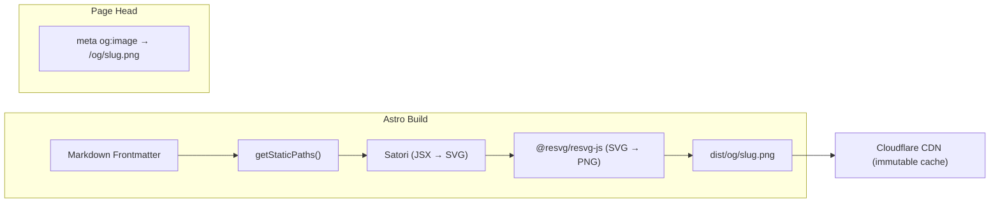

# ADR-011: Dynamic OpenGraph Image Generation

| Field | Value |
|---|---|
| **Status** | ✅ Accepted |
| **Date** | 2026-02-23 |
| **Deciders** | Harshit Sharma |

## Context

When a project page or algorithm solution is shared on LinkedIn, Twitter/X, or Discord, the platform renders an Open Graph preview card. Without a custom OG image, the link appears as a plain text URL — dramatically reducing click-through rates.

Manually creating images in Photoshop/Figma for every content entry (100+ algorithm solutions, 10+ projects, daily logs) is not scalable.

## Decision

Generate OG images **at build time** using **Satori** (HTML/CSS → SVG) + **@resvg/resvg-js** (SVG → PNG), leveraging Markdown frontmatter for dynamic content.

### Why Build-Time Over Runtime

| Criteria | Build-Time (`getStaticPaths`) | Runtime (per-request) |
|---|---|---|
| Latency | **0ms** (pre-generated, CDN-cached) | ~200-500ms per generation |
| Cloudflare Worker CPU | **None** (static file) | 10ms limit risk |
| Cost | **Free** (generated once) | CPU per request |
| CDN cacheability | **Immutable** | Requires SWR logic |
| Complexity | Moderate | Higher |

**Build-time wins because:** Content changes only on `git push`, so generating once at build time is sufficient. No runtime CPU cost.

### Architecture



### Implementation

```typescript
// src/pages/og/[...slug].png.ts
import type { APIRoute } from 'astro';
import { getCollection } from 'astro:content';
import satori from 'satori';
import { Resvg } from '@resvg/resvg-js';
import { readFileSync } from 'node:fs';

const inter = readFileSync('./public/fonts/inter-var-latin.woff2');

export async function getStaticPaths() {
  const projects = await getCollection('projects');
  const algorithms = await getCollection('algorithms');
  const logs = await getCollection('logs');

  return [
    ...projects.map((p) => ({
      params: { slug: `projects/${p.id}` },
      props: { title: p.data.title, type: 'Project', extra: p.data.techStack.join(' · ') },
    })),
    ...algorithms.map((a) => ({
      params: { slug: `algorithms/${a.id}` },
      props: { title: a.data.title, type: a.data.platform, extra: `${a.data.timeComplexity} | ${a.data.difficulty}` },
    })),
    ...logs.map((l) => ({
      params: { slug: `logs/${l.id}` },
      props: { title: l.data.title, type: l.data.type, extra: l.data.tags.join(' · ') },
    })),
  ];
}

export const GET: APIRoute = async ({ props }) => {
  const { title, type, extra } = props as {
    title: string; type: string; extra: string;
  };

  const svg = await satori(
    {
      type: 'div',
      props: {
        style: {
          display: 'flex', flexDirection: 'column', justifyContent: 'center',
          width: '100%', height: '100%', padding: '60px',
          background: 'linear-gradient(135deg, #0d1117 0%, #161b22 100%)',
          color: '#e6edf3', fontFamily: 'Inter',
        },
        children: [
          { type: 'div', props: { style: { fontSize: 24, color: '#2dd4bf', marginBottom: 16 }, children: type.toUpperCase() } },
          { type: 'div', props: { style: { fontSize: 48, fontWeight: 700, lineHeight: 1.2, marginBottom: 24 }, children: title } },
          { type: 'div', props: { style: { fontSize: 20, color: '#8b949e' }, children: extra } },
          { type: 'div', props: { style: { fontSize: 18, color: '#2dd4bf', marginTop: 'auto' }, children: 'harshit.systems' } },
        ],
      },
    },
    {
      width: 1200,
      height: 630,
      fonts: [{ name: 'Inter', data: inter, weight: 400, style: 'normal' }],
    },
  );

  const png = new Resvg(svg, { fitTo: { mode: 'width', value: 1200 } }).render().asPng();

  return new Response(png, {
    headers: {
      'Content-Type': 'image/png',
      'Cache-Control': 'public, max-age=86400, immutable',
    },
  });
};
```

### Integration with BaseHead

```astro
<!-- In BaseHead.astro -->
<meta property="og:image" content={new URL(`/og/${Astro.url.pathname.slice(1)}.png`, Astro.site)} />
<meta property="og:image:width" content="1200" />
<meta property="og:image:height" content="630" />
<meta property="twitter:card" content="summary_large_image" />
```

### OG Card Design Spec

| Element | Dark Theme Value |
|---|---|
| Background | `#0d1117` → `#161b22` gradient |
| Title | `#e6edf3`, Inter 48px Bold |
| Category badge | `#2dd4bf` (teal accent), 24px |
| Metadata line | `#8b949e`, 20px |
| Domain watermark | `#2dd4bf`, 18px, bottom-left |
| Dimensions | 1200 × 630px (standard OG ratio) |

## Consequences

- `satori` + `@resvg/resvg-js` add ~5s to build time per 100 images
- Fonts must be loaded as raw buffers (not CSS font-face)
- OG images regenerated on every build (simple, no stale images)
- Each page gets a unique, branded OG card — no manual design work

## References

- [Satori documentation](https://github.com/vercel/satori)
- [Astro OG image guide](https://docs.astro.build/en/guides/images/)
