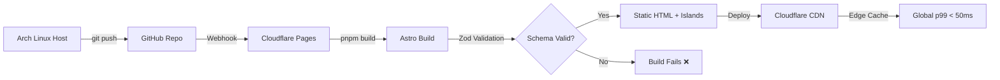
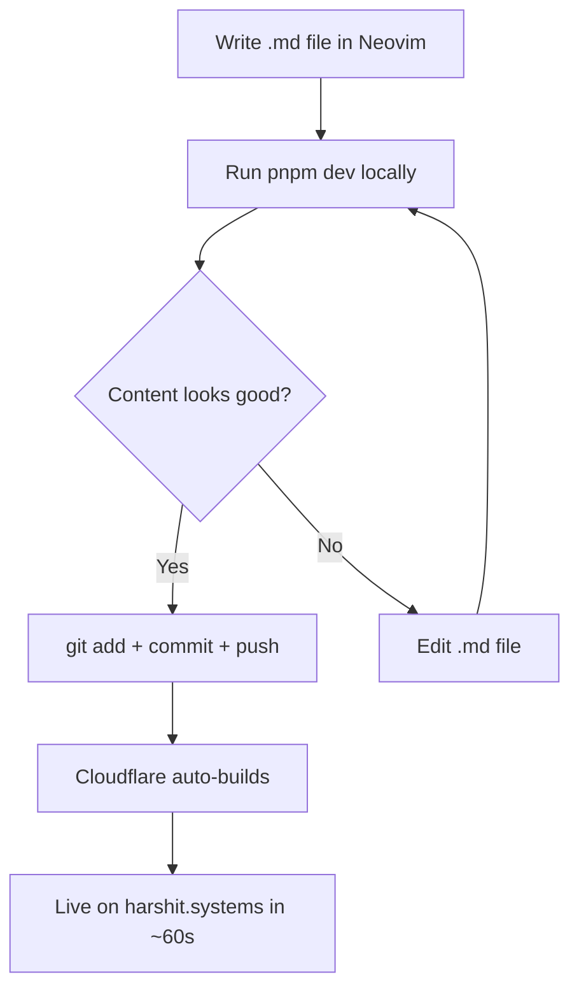

# System Design Document: harshit.systems

> **Version:** 2.0.0 | **Last Updated:** 2026-02-22 | **Status:** Active

## 1. System Overview

**Purpose:** A statically generated, high-performance engineering portfolio functioning as Harshit's digital identity hub — targeting **recruiters**, **hiring managers**, and **fellow developers**.

**Core Differentiators:**
- Not a template portfolio — an engineered digital identity with daily/weekly content updates
- Subdomain-based project isolation (`project.harshit.systems`)
- Zero-JS-by-default architecture with selective island hydration
- Content-driven with Zod-validated type-safe data layer

**Primary Constraints:**
| Constraint | Target | Rationale |
|---|---|---|
| LCP | < 1.0s | Sub-second paint via CDN + inline critical CSS + self-hosted fonts |
| CLS | < 0.05 | Explicit image dimensions + font-display:swap fallback |
| Lighthouse Score | 100/100 (all categories) | Astro SSG + zero JS default makes this achievable |
| JS Bundle (core) | 0 KB | Only island components ship JS |
| Build Time | < 30s (100 pages) | Astro 5 Content Layer: 5x faster Markdown builds |

## 2. Architecture Principles

```
┌─────────────────────────────────────────────────────┐
│              ARCHITECTURE PRINCIPLES                │
├─────────────────────────────────────────────────────┤
│  1. Content-First    → Markdown drives everything   │
│  2. Islands-Only JS  → JS ships only for islands    │
│  3. Server-First     → HTML rendered at build time  │
│  4. Edge-Delivered   → Cloudflare CDN, global p99   │
│  5. Type-Safe Data   → Zod schemas enforce shape    │
│  6. Easy to Update   → Add .md file, push, done     │
│  7. Secure by Default→ CSP headers, CORS, no DB     │
└─────────────────────────────────────────────────────┘
```

## 3. Technology Stack

| Layer | Technology | Version | Rationale |
|---|---|---|---|
| **Framework** | Astro | 5.17.1+ | Content-driven, Islands architecture, zero JS default |
| **Styling** | Tailwind CSS | 4.x | CSS-first config via `@tailwindcss/vite`, Oxide engine (5x faster) |
| **Client Islands** | Preact | 10.x | 3kB React-compatible API, smallest island footprint |
| **State** | nanostores | 0.11+ | Cross-island state (< 1KB), `@nanostores/persistent` for theme |
| **Content** | Markdown + Zod | — | `glob()` loader, `astro:content` API, build-time validation |
| **Syntax Highlighting** | Shiki | built-in | VSCode-quality highlighting, Expressive Code for advanced |
| **BaaS** | Appwrite Cloud | latest | Student account, Tables/Rows API, contact form + page views |
| **Hosting** | Cloudflare Pages | — | Free tier, global CDN, `_headers` for CSP, Workers for SSR |
| **DNS** | Cloudflare DNS | — | Proxy + HTTPS + WAF included |
| **Images** | astro:assets | built-in | Auto WebP/AVIF, responsive `srcset`, lazy loading |
| **SEO** | @astrojs/sitemap + @astrojs/rss | — | Auto sitemap + RSS for engineering logs |
| **OG Images** | Satori + @resvg/resvg-js | — | Dynamic OG image generation at build time |
| **Transitions** | ClientRouter | built-in | SPA-feel navigation with `transition:name`/`persist` |
| **Package Manager** | pnpm | 9.x | Strict, fast, disk-efficient |

## 4. Architecture Decision Records

Each ADR has its own detailed page in [architecture/ADR/](./ADR/).

| ID | Decision | Status |
|---|---|---|
| [ADR-001](./ADR/ADR-001-astro-content-layer.md) | Astro 5 with Content Layer API | ✅ Accepted |
| [ADR-002](./ADR/ADR-002-glob-loader-zod.md) | `glob()` loader + Zod strict schemas | ✅ Accepted |
| [ADR-003](./ADR/ADR-003-preact-islands.md) | Preact for client islands | ✅ Accepted |
| [ADR-004](./ADR/ADR-004-appwrite-baas.md) | Appwrite Cloud as headless BaaS | ✅ Accepted |
| [ADR-005](./ADR/ADR-005-cloudflare-pages.md) | Cloudflare Pages for hosting | ✅ Accepted |
| [ADR-006](./ADR/ADR-006-view-transitions.md) | View Transitions via `<ClientRouter />` | ✅ Accepted |
| [ADR-007](./ADR/ADR-007-tailwind-css-4.md) | Tailwind CSS 4 via Vite plugin | ✅ Accepted |
| [ADR-008](./ADR/ADR-008-sitemap-rss.md) | `@astrojs/sitemap` + `@astrojs/rss` for SEO | ✅ Accepted |
| [ADR-009](./ADR/ADR-009-json-ld.md) | JSON-LD structured data (Person + SoftwareApplication) | ✅ Accepted |
| [ADR-010](./ADR/ADR-010-subdomain-isolation.md) | Subdomain isolation for deployed projects | ✅ Accepted |
| [ADR-011](./ADR/ADR-011-og-image-generation.md) | Dynamic OG Image Generation (Satori + Resvg) | ✅ Accepted |

## 5. Data Architecture

### A. Static Layer — Content Collections (Build-Time)

All content lives as Markdown files validated by Zod schemas at build time. Config at `src/content.config.ts`:

```typescript
// src/content.config.ts — Astro 5 Content Layer API
import { defineCollection } from 'astro:content';
import { glob } from 'astro/loaders';
import { z } from 'astro/zod';

const projects = defineCollection({
  loader: glob({ pattern: '**/*.md', base: './src/data/projects' }),
  schema: z.object({
    title: z.string(),
    description: z.string(),
    techStack: z.array(z.string()),
    liveUrl: z.string().url().optional(),
    githubUrl: z.string().url(),
    thumbnail: z.string(),
    featured: z.boolean().default(false),
    subdomain: z.string().optional(), // e.g. "vault-ledger"
    category: z.enum(['fullstack', 'backend', 'frontend', 'systems', 'mobile']),
    pubDate: z.coerce.date(),
  }),
});

const algorithms = defineCollection({
  loader: glob({ pattern: '**/*.md', base: './src/data/algorithms' }),
  schema: z.object({
    title: z.string(),
    platform: z.enum(['codeforces', 'leetcode', 'atcoder', 'cses', 'codechef']),
    difficulty: z.enum(['easy', 'medium', 'hard', 'expert']),
    rating: z.number().optional(),
    tags: z.array(z.string()),
    timeComplexity: z.string(),
    spaceComplexity: z.string(),
    language: z.enum(['cpp', 'rust', 'python']).default('cpp'),
    pubDate: z.coerce.date(),
  }),
});

const logs = defineCollection({
  loader: glob({ pattern: '**/*.md', base: './src/data/logs' }),
  schema: z.object({
    title: z.string(),
    type: z.enum(['daily', 'weekly', 'project', 'problem']),
    tags: z.array(z.string()),
    mood: z.enum(['productive', 'learning', 'struggling', 'breakthrough']).optional(),
    pubDate: z.coerce.date(),
  }),
});

export const collections = { projects, algorithms, logs };
```

### B. Dynamic Layer — Appwrite Tables (Runtime)

| Table | Columns | Purpose |
|---|---|---|
| `PageViews` | `slug` (String, Unique), `views` (Integer) | Track page popularity |
| `ContactMessages` | `name` (String), `email` (Email), `message` (String), `createdAt` (Datetime) | Contact form submissions |

> **Note:** Engineering logs are **NOT** in Appwrite — they live as Markdown files in the static layer for version control and build-time rendering. Appwrite is reserved strictly for runtime interactions.

## 6. Deployment Pipeline



**Build Steps:**
1. `pnpm install --frozen-lockfile`
2. Zod validates all Markdown frontmatter
3. Astro generates static HTML (zero JS for content pages)
4. Tailwind CSS 4 purges unused styles
5. `astro:assets` converts images to WebP/AVIF
6. Satori generates OG images for each page
7. Sitemap + RSS feed generated
8. Deploy to Cloudflare Pages CDN (200+ edge locations)

## 7. Security Model

### Cloudflare `_headers` File
```
/*
  X-Content-Type-Options: nosniff
  X-Frame-Options: DENY
  X-XSS-Protection: 1; mode=block
  Referrer-Policy: strict-origin-when-cross-origin
  Permissions-Policy: camera=(), microphone=(), geolocation=()
  Strict-Transport-Security: max-age=31536000; includeSubDomains; preload
  Content-Security-Policy: default-src 'self'; script-src 'self' 'unsafe-inline'; style-src 'self' 'unsafe-inline'; img-src 'self' data: https:; font-src 'self'; connect-src 'self' https://cloud.appwrite.io; frame-ancestors 'none'
```

### API Route Hardening
- **CORS:** Strict origin check (`harshit.systems` only)
- **Rate Limiting:** Cloudflare WAF rules (100 req/min per IP, 5 req/min on `/api/contact`)
- **Input Validation:** Zod schemas on all API route inputs
- **No Database Credentials:** Appwrite SDK uses project-level API keys (read-only for analytics)
- **Idempotency:** Contact form uses client-generated UUID to prevent duplicate submissions

> **⚠️ SSR Requirement:** `/api/views` and `/api/contact` require `export const prerender = false;` and the `@astrojs/cloudflare` adapter. Without these, API routes are build-time static endpoints only.

## 7.1 Accessibility

| Requirement | Target | Implementation |
|---|---|---|
| WCAG Level | AA | Semantic HTML, ARIA labels |
| Keyboard Navigation | Full | `tabindex`, focus rings, skip-to-content link |
| Color Contrast | 4.5:1 minimum | Verified in both light/dark themes |
| Screen Reader | Full support | `aria-label`, `alt` text, landmark roles |
| Reduced Motion | Supported | `prefers-reduced-motion` media query disables animations |
| Focus Indicators | Visible | Tailwind `focus-visible:ring-2` on all interactive elements |

## 8. Performance Budget

| Metric | Target | How |
|---|---|---|
| **LCP** | < 1.0s | Self-hosted fonts with `font-display:swap`, preload LCP image, inline critical CSS |
| **FID/INP** | < 100ms | Zero JS by default; islands hydrate via `client:idle` or `client:visible` |
| **CLS** | < 0.05 | Explicit `width`/`height` on all images, font fallback metrics |
| **TTFB** | < 200ms | Cloudflare CDN static cache, edge-served HTML |
| **Total JS** | < 10KB (gzipped) | Only Preact islands (ThemeToggle, ContactForm). No React. |
| **CSS** | < 15KB (gzipped) | Tailwind CSS 4 purge + inline critical path |
| **Font** | < 50KB total | Subset Inter/JetBrains Mono, WOFF2 only |

## 9. Content Update Workflow



**Cadence:**
- **Daily logs:** Quick markdown entries in `src/data/logs/daily/`
- **Weekly logs:** Summary in `src/data/logs/weekly/`
- **Project logs:** Per-project updates in `src/data/logs/project/`
- **CP problems:** New algorithm entries in `src/data/algorithms/`

## 10. Domain Architecture

```
harshit.systems/              ← This portfolio (Astro SSG)
├── /                         ← Hero + About + Featured Projects
├── /projects/                ← All projects with case studies
├── /projects/[id]            ← Individual project deep-dive
├── /algorithms/              ← CP problem solutions index
├── /algorithms/[id]          ← Individual solution with code
├── /logs/                    ← Engineering logs feed
├── /logs/[id]                ← Individual log entry
├── /contact/                 ← Contact form → Appwrite
├── /api/views.ts             ← Page view counter endpoint (prerender: false, needs adapter)
├── /api/contact.ts           ← Contact form handler (prerender: false, needs adapter)

├── /rss.xml                  ← RSS feed for logs
└── /sitemap.xml              ← Auto-generated sitemap

blog.harshit.systems/         ← Separate blog site (external link)
vault-ledger.harshit.systems/ ← Project subdomain (separate deploy)
```
