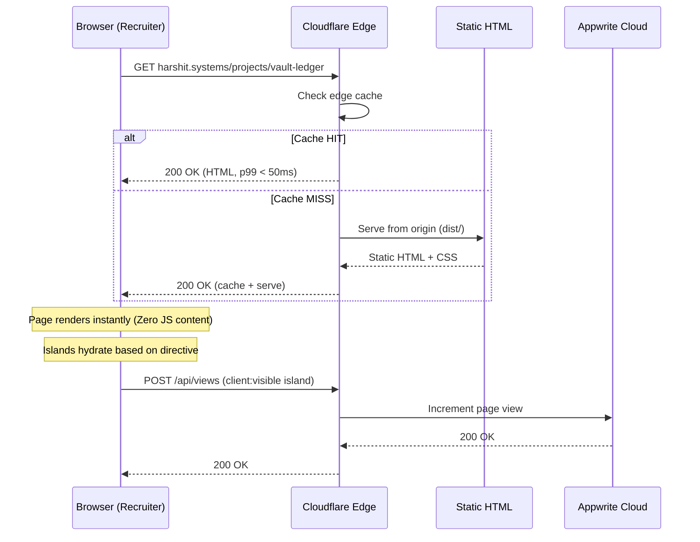

# High-Level Design — Request Flow

## Browser → Edge → Static HTML

## Key Properties

| Property | Value |
|---|---|
| **First byte** | < 200ms (Cloudflare edge cache) |
| **HTML size** | < 50KB per page (no JS runtime) |
| **Cache strategy** | Immutable assets (hashed filenames) + HTML stale-while-revalidate |
| **SSL** | Cloudflare Universal SSL (free, auto-renewed) |
| **WAF** | Cloudflare managed rules (bot protection, rate limiting) |

## Request Types

| Path Pattern | Type | Handler |
|---|---|---|
| `/`, `/projects/*`, `/algorithms/*`, `/logs/*` | Static HTML | Cloudflare CDN cache |
| `/api/views.ts` | API endpoint | Cloudflare Worker (or build-time if SSG) |
| `/api/contact.ts` | API endpoint | Cloudflare Worker |
| `*.css`, `*.js`, `*.woff2` | Static assets | Cloudflare CDN (immutable) |
| `/rss.xml`, `/sitemap*.xml` | SEO files | Static, generated at build time |
