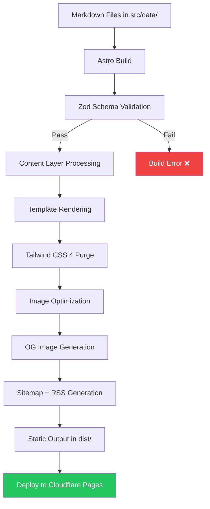

# High-Level Design — Build Pipeline

## Content → Static Site



## Build Step Details

| Step | Tool | Input | Output | Duration |
|---|---|---|---|---|
| 1. Install | `pnpm install --frozen-lockfile` | `pnpm-lock.yaml` | `node_modules/` | ~5s |
| 2. Validate | Zod schemas | Markdown frontmatter | Type-safe data objects | ~1s |
| 3. Render | Astro compiler | `.astro` + `.md` + `.tsx` | HTML strings | ~5s |
| 4. Style | Tailwind CSS 4 (Oxide) | CSS + templates | Purged CSS (< 15KB) | ~1s |
| 5. Images | `astro:assets` | PNG/JPG in `src/` | WebP/AVIF in `dist/` | ~3s |
| 6. OG Images | Satori + Resvg | Page titles | PNG files (1200x630) | ~5s |
| 7. SEO | `@astrojs/sitemap` + `@astrojs/rss` | Route list | `sitemap.xml` + `rss.xml` | < 1s |
| 8. SSR Bundle | `@astrojs/cloudflare` adapter | `prerender:false` endpoints | Worker scripts for `/api/*` | ~2s |
| 9. Output | Astro | All above | `dist/` directory (static + worker) | ~1s |
| **Total** | | | | **< 25s** |

## Content Layer Data Flow

```mermaid
graph LR
    subgraph Source ["Source Files"]
        MD1[projects/*.md]
        MD2[algorithms/*.md]
        MD3[logs/daily/*.md]
        MD4[logs/weekly/*.md]
    end

    subgraph Config ["src/content.config.ts"]
        Z1[Zod: ProjectSchema]
        Z2[Zod: AlgorithmSchema]
        Z3[Zod: LogSchema]
    end

    subgraph Build ["Build Output"]
        P1[/projects/index.html]
        P2[/projects/vault-ledger/index.html]
        P3[/algorithms/index.html]
        P4[/logs/index.html]
    end

    MD1 --> Z1 --> P1
    MD1 --> Z1 --> P2
    MD2 --> Z2 --> P3
    MD3 --> Z3 --> P4
    MD4 --> Z3 --> P4
```

## Environment Variables

| Variable | Build/Runtime | Purpose |
|---|---|---|
| `PUBLIC_APPWRITE_ENDPOINT` | Both | Appwrite API URL |
| `PUBLIC_APPWRITE_PROJECT_ID` | Both | Appwrite project ID |
| `PUBLIC_APPWRITE_DB_ID` | Both | Appwrite database ID |
| `SITE_URL` | Build | `https://harshit.systems` |
