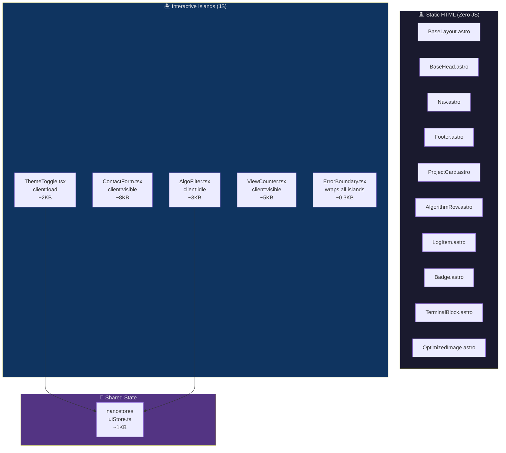

# High-Level Design — Island Hydration Map

## Static vs Interactive Components



## Hydration Directive Decision Matrix

| Component | Directive | JS Impact | When Hydrated | Why This Directive |
|---|---|---|---|---|
| `ThemeToggle.tsx` | `client:load` | 2KB | Immediately on page load | Prevents FOUC; above-the-fold; user expects instant toggle |
| `ContactForm.tsx` | `client:visible` | 8KB | When scrolled into viewport | Below fold; no need to load until user sees it |
| `AlgoFilter.tsx` | `client:idle` | 3KB | When browser is idle | Enhancement, not critical; can wait for main thread |
| `ViewCounter.tsx` | `client:visible` | 5KB | When scrolled into viewport | Passive analytics; no rush |

## State Architecture

```typescript
// src/store/uiStore.ts
import { persistentAtom } from '@nanostores/persistent';
import { atom } from 'nanostores';

// Theme persists across sessions + view transitions
export const $theme = persistentAtom<'light' | 'dark' | 'system'>('theme', 'system');

// Algorithm filter — resets on page navigation
export const $algoFilter = atom<{
  platform: string | null;
  difficulty: string | null;
  tag: string | null;
}>({ platform: null, difficulty: null, tag: null });
```

## Total JS Budget

| Source | Size (gzipped) |
|---|---|
| Preact runtime | 3 KB |
| ThemeToggle | 2 KB |
| AlgoFilter | 3 KB |
| ViewCounter (Appwrite SDK chunk) | 5 KB |
| ContactForm (Appwrite SDK chunk) | 8 KB |
| nanostores + persistent | 1 KB |
| **Total (worst case, all islands on one page)** | **~15 KB** |
| **Typical page (only ThemeToggle)** | **~5 KB** |

## FOUC Prevention

Dark mode requires a render-blocking `is:inline` script in `<head>` to avoid Flash of Unstyled Content:

```html
<!-- In BaseLayout.astro <head> — runs BEFORE first paint -->
<script is:inline>
  (function() {
    const theme = localStorage.getItem('harshit:theme') || 'system';
    const isDark = theme === 'dark' ||
      (theme === 'system' && window.matchMedia('(prefers-color-scheme: dark)').matches);
    document.documentElement.classList.toggle('dark', isDark);
  })();
</script>
```

**Why `is:inline`?** — Astro normally bundles and defers scripts. `is:inline` forces the script into the raw HTML so it executes synchronously before the browser paints, preventing a white flash when the user has dark mode selected.

## Graceful Degradation

All islands are wrapped in `ErrorBoundary.tsx`. If a Preact island fails:
1. The error is logged to console
2. The island renders nothing (or a fallback emoji)
3. The rest of the page (static HTML) remains fully functional
4. No full-page crash — islands are isolated from each other
