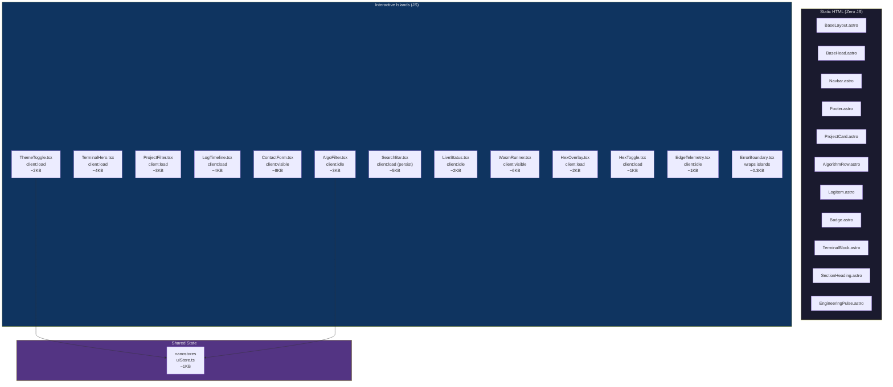

# High-Level Design — Island Hydration Map

## Static vs Interactive Components



## Hydration Directive Decision Matrix

| Component | Directive | JS Impact | When Hydrated | Why This Directive |
|---|---|---|---|---|
| `ThemeToggle.tsx` | `client:load` | 2KB | Immediately on page load | Prevents FOUC; above-the-fold; user expects instant toggle |
| `TerminalHero.tsx` | `client:load` | 4KB | Immediately on page load | Above-the-fold hero animation; uses CSS vars for theme |
| `ProjectFilter.tsx` | `client:load` | 3KB | Immediately on page load | Category filter for /projects; receives serialised data |
| `LogTimeline.tsx` | `client:load` | 4KB | Immediately on page load | Tag filter + accordion for /logs; commit-log style UI |
| `SearchBar.tsx` | `client:load` | 5KB | Immediately, persists across navigations | Cmd+K command palette; must survive View Transitions |
| `HexOverlay.tsx` | `client:load` | 2KB | Immediately on page load | Background hex grid animation on homepage |
| `HexToggle.tsx` | `client:load` | 1KB | Immediately on page load | Toggle for hex overlay visibility |
| `ContactForm.tsx` | `client:visible` | 8KB | When scrolled into viewport | Below fold; no need to load until user sees it |
| `WasmRunner.tsx` | `client:visible` | 6KB | When scrolled into viewport | Algorithm WASM execution; below fold on detail pages |
| `AlgoFilter.tsx` | `client:idle` | 3KB | When browser is idle | Enhancement, not critical; can wait for main thread |
| `LiveStatus.tsx` | `client:idle` | 2KB | When browser is idle | Fetches /api/status; not critical for first paint |
| `EdgeTelemetry.tsx` | `client:idle` | 1KB | When browser is idle | Pings CF trace endpoint; purely diagnostic |

## State Architecture

```typescript
// src/store/uiStore.ts
import { atom } from 'nanostores';

export const THEME_KEY = 'harshit:theme'; // namespaced localStorage key
// SSR-safe: starts 'dark' on server. FOUC script in BaseHead sets data-theme.
export const $theme = atom<'dark' | 'light'>('dark');
// Toggle dark↔light only (no system mode)

// Algorithm filter — resets on page navigation
export const $algoFilter = atom<{
  platform: string | null;
  difficulty: string | null;
  tag: string | null;
}>({ platform: null, difficulty: null, tag: null });
```

## Total JS Budget

| Source | Size (gzipped) |
|---|---|
| Preact runtime | 3 KB |
| ThemeToggle | 2 KB |
| SearchBar (command palette) | 5 KB |
| TerminalHero | 4 KB |
| HexOverlay + HexToggle | 3 KB |
| AlgoFilter | 3 KB |
| LiveStatus | 2 KB |
| ContactForm | 8 KB |
| WasmRunner (algorithm pages only) | 6 KB |
| nanostores + persistent | 1 KB |
| EdgeTelemetry | 1 KB |
| **Total (worst case, all islands on one page)** | **~28 KB** |
| **Homepage (ThemeToggle + SearchBar + TerminalHero + Hex + Pulse section)** | **~15 KB** |
| **Typical detail page (ThemeToggle + SearchBar)** | **~10 KB** |

## FOUC Prevention

Dark mode requires a render-blocking `is:inline` script in `<head>` to avoid Flash of Unstyled Content:

```html
<!-- In BaseHead.astro <head> — runs BEFORE first paint -->
<script is:inline>
  (function() {
    var s = localStorage.getItem('harshit:theme');
    var resolved = (s === 'light') ? 'light'
      : (s === 'dark') ? 'dark'
      : window.matchMedia('(prefers-color-scheme: dark)').matches ? 'dark' : 'light';
    document.documentElement.setAttribute('data-theme', resolved);
  })();
</script>
```

**Why `is:inline`?** — Astro normally bundles and defers scripts. `is:inline` forces the script into the raw HTML so it executes synchronously before the browser paints, preventing a white flash when the user has dark mode selected.

## Graceful Degradation

All islands are wrapped in `ErrorBoundary.tsx`. If a Preact island fails:
1. The error is logged to console
2. The island renders nothing (or a fallback emoji)
3. The rest of the page (static HTML) remains fully functional
4. No full-page crash — islands are isolated from each other
