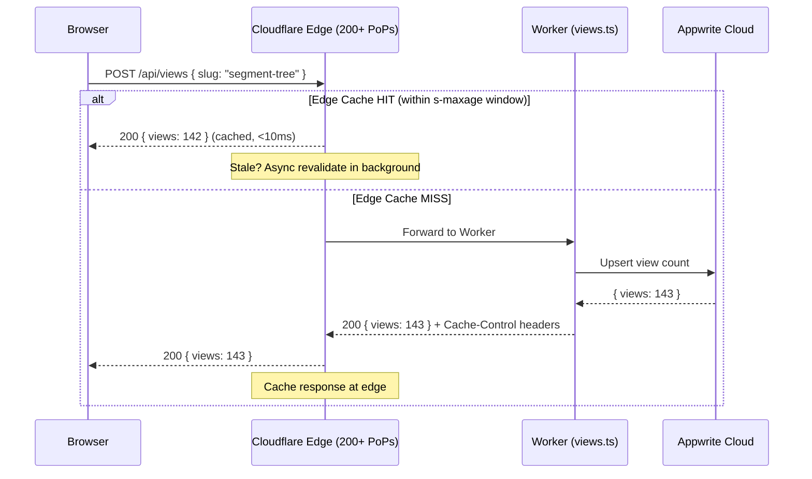

# HLD/05 — Edge Caching & Stale-While-Revalidate (SWR)

## The Problem

The `/api/views` endpoint hits Appwrite on every request. Under a traffic spike (recruiter shares a post → 5K hits/hour), the Appwrite Student Tier will be overwhelmed with read/write operations.

## The Solution: CDN-Level SWR Caching



## Cache-Control Header Strategy

```typescript
// In /api/views.ts response
return new Response(JSON.stringify({ slug, views }), {
  status: 200,
  headers: {
    'Content-Type': 'application/json',
    // Browser: never cache (views should look fresh to user)
    'Cache-Control': 'public, max-age=0, s-maxage=60, stale-while-revalidate=300',
    'Access-Control-Allow-Origin': 'https://harshit.systems',
    // CDN cache key: vary by nothing (same count for everyone)
    'CDN-Cache-Control': 'max-age=60',
  },
});
```

### Header Breakdown

| Directive | Value | Effect |
|---|---|---|
| `max-age=0` | 0 seconds | Browser: always revalidate (views should appear fresh) |
| `s-maxage=60` | 60 seconds | **Cloudflare edge**: cache for 60s. Max 1 Appwrite call/min/PoP |
| `stale-while-revalidate=300` | 5 minutes | Edge serves stale while fetching fresh data in background |
| `CDN-Cache-Control` | 60s | Cloudflare-specific override (takes priority over `s-maxage`) |

### Traffic Math

| Scenario | Without SWR | With SWR (s-maxage=60) |
|---|---|---|
| 5,000 hits/hour, 1 PoP | **5,000 Appwrite calls** | **60 Appwrite calls** (1/min) |
| 5,000 hits/hour, 10 PoPs | **5,000 Appwrite calls** | **600 Appwrite calls** (1/min/PoP) |
| 50,000 hits/hour (viral) | ⚠️ **Rate limited** | **600 Appwrite calls** (unchanged) |

> **Result:** 83x reduction in Appwrite load. The edge absorbs the traffic; Appwrite only sees 1 request per PoP per minute regardless of visitor count.

## Endpoint Design Change

The `/api/views` endpoint should be split into two concerns:

```
GET  /api/views?slug=X    → Read view count (cacheable, SWR headers)
POST /api/views           → Increment view count (NOT cacheable)
```

This allows the GET to be edge-cached while the POST always reaches the Worker:

```typescript
// GET: Returns cached view count
export const GET: APIRoute = async ({ url }) => {
  const slug = url.searchParams.get('slug');
  // ... fetch from Appwrite
  return new Response(JSON.stringify({ slug, views }), {
    headers: {
      'Cache-Control': 'public, max-age=0, s-maxage=60, stale-while-revalidate=300',
    },
  });
};

// POST: Increments and returns new count (never cached)
export const POST: APIRoute = async ({ request }) => {
  // ... upsert logic
  return new Response(JSON.stringify({ slug, views }), {
    headers: { 'Cache-Control': 'no-store' },
  });
};
```

## Static Asset Caching

For non-API content served by Cloudflare Pages:

```
# public/_headers
/*.js
  Cache-Control: public, max-age=31536000, immutable

/*.css
  Cache-Control: public, max-age=31536000, immutable

/*.woff2
  Cache-Control: public, max-age=31536000, immutable

/*.html
  Cache-Control: public, max-age=0, s-maxage=3600, stale-while-revalidate=86400

/og/*
  Cache-Control: public, max-age=86400, immutable
```

| Asset Type | Strategy | Max-Age |
|---|---|---|
| JS/CSS/Fonts (hashed filenames) | **Immutable** — never revalidate | 1 year |
| HTML pages | **SWR** — serve stale up to 24h while rebuilding | 1 hour CDN |
| OG images | **Immutable** — regenerated on build only | 24 hours |
| API responses | **SWR** — 60s fresh, 5min stale | 60 seconds |
