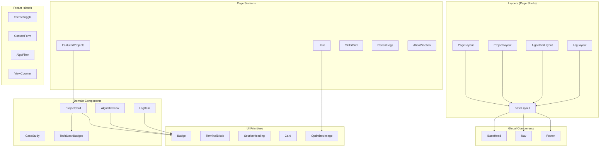

# Low-Level Design — Component Specifications

## Component Architecture



## Component Specifications

### BaseLayout.astro

| Property | Type | Required | Description |
|---|---|---|---|
| `title` | `string` | ✅ | Page title |
| `description` | `string` | ✅ | Meta description |
| `image` | `string` | ❌ | OG image path (default: `/og-default.png`) |
| `type` | `'website' \| 'article'` | ❌ | OG type (default: `website`) |

```astro
---
// BaseLayout.astro — renders <html>, <head>, <body> wrapper
import BaseHead from './BaseHead.astro';
import Nav from './Nav.astro';
import Footer from './Footer.astro';
import ThemeToggle from '../islands/ThemeToggle.tsx';

interface Props {
  title: string;
  description: string;
  image?: string;
  type?: 'website' | 'article';
}
const { title, description, image, type } = Astro.props;
---
<!doctype html>
<html lang="en" class="dark">
  <head>
    <BaseHead {title} {description} {image} {type} />
    <!-- ⚠️ CRITICAL: FOUC prevention — must be is:inline in <head> -->
    <script is:inline>
      (function() {
        const theme = localStorage.getItem('harshit:theme') || 'system';
        const isDark = theme === 'dark' ||
          (theme === 'system' && window.matchMedia('(prefers-color-scheme: dark)').matches);
        document.documentElement.classList.toggle('dark', isDark);
      })();
    </script>
  </head>
  <body class="bg-bg-primary text-text-primary font-sans antialiased">
    <!-- Accessibility: skip-to-content link -->
    <a href="#main-content" class="sr-only focus:not-sr-only focus:absolute focus:z-50 focus:p-4 focus:bg-accent focus:text-bg-primary">
      Skip to content
    </a>
    <Nav />
    <ThemeToggle client:load />
    <main id="main-content">
      <slot />
    </main>
    <Footer />
  </body>
</html>
```

---

### ProjectCard.astro

| Property | Type | Required | Description |
|---|---|---|---|
| `title` | `string` | ✅ | Project name |
| `description` | `string` | ✅ | Short description |
| `techStack` | `string[]` | ✅ | Technology badges |
| `liveUrl` | `string` | ❌ | Live demo link |
| `githubUrl` | `string` | ✅ | GitHub repo link |
| `thumbnail` | `string` | ❌ | Thumbnail image path |
| `featured` | `boolean` | ❌ | Featured flag |
| `id` | `string` | ✅ | Content collection entry ID |

**Hydration:** Static (zero JS) — Pure `.astro` component.

---

### ThemeToggle.tsx (Preact Island)

| Property | Type | Required | Description |
|---|---|---|---|
| (none) | — | — | Self-contained, reads/writes `$theme` nanostore |

**Hydration:** `client:load` — Must be interactive immediately.

```tsx
// ThemeToggle.tsx
import { useStore } from '@nanostores/preact';
import { $theme } from '../store/uiStore';

export default function ThemeToggle() {
  const theme = useStore($theme);

  const cycleTheme = () => {
    const next = theme === 'light' ? 'dark' : theme === 'dark' ? 'system' : 'light';
    $theme.set(next);
    applyTheme(next);
  };

  return (
    <button onClick={cycleTheme} aria-label={`Current theme: ${theme}`}>
      {theme === 'light' ? '☀️' : theme === 'dark' ? '🌙' : '🖥️'}
    </button>
  );
}

function applyTheme(theme: 'light' | 'dark' | 'system') {
  const isDark = theme === 'dark' ||
    (theme === 'system' && window.matchMedia('(prefers-color-scheme: dark)').matches);
  document.documentElement.classList.toggle('dark', isDark);
}
```

---

### ContactForm.tsx (Preact Island)

| Property | Type | Required | Description |
|---|---|---|---|
| (none) | — | — | Self-contained, submits to Appwrite |

**Hydration:** `client:visible` — Only loads when user scrolls to contact section.

**Validation:** Inline Zod or HTML5 validation:
- `name`: required, min 2 chars
- `email`: required, valid email format
- `message`: required, min 10 chars, max 1000 chars

**Submit flow:** Form data → Appwrite `ContactMessages` table → show success/error state.

---

### AlgoFilter.tsx (Preact Island)

| Property | Type | Required | Description |
|---|---|---|---|
| `platforms` | `string[]` | ✅ | Available platform filter options |
| `difficulties` | `string[]` | ✅ | Available difficulty levels |
| `tags` | `string[]` | ✅ | Available tags |

**Hydration:** `client:idle` — Enhancement, not critical path.

**State:** Writes to `$algoFilter` nanostore. Algorithm page reads this store to filter displayed entries.

---

### ViewCounter.tsx (Preact Island)

| Property | Type | Required | Description |
|---|---|---|---|
| `slug` | `string` | ✅ | Page slug for view tracking |

**Hydration:** `client:visible` — Pings API when component enters viewport.

**Behavior:** On mount → `POST /api/views` with slug → render returned count.

---

### ErrorBoundary.tsx (Preact Utility)

| Property | Type | Required | Description |
|---|---|---|---|
| `fallback` | `ComponentChildren` | ❌ | Fallback UI on error (default: silent fail) |
| `children` | `ComponentChildren` | ✅ | Wrapped island component(s) |

**Purpose:** Wraps all Preact islands so a runtime JS error in one island doesn't crash the page. Since the page is mostly static HTML, a broken island should degrade gracefully.

```tsx
// ErrorBoundary.tsx
import { Component, type ComponentChildren } from 'preact';

interface Props {
  fallback?: ComponentChildren;
  children: ComponentChildren;
}

interface State { hasError: boolean }

export class ErrorBoundary extends Component<Props, State> {
  state = { hasError: false };

  static getDerivedStateFromError() {
    return { hasError: true };
  }

  componentDidCatch(error: Error) {
    console.error('[Island Error]', error);
  }

  render() {
    if (this.state.hasError) {
      return this.props.fallback ?? null; // Silent fail — page stays functional
    }
    return this.props.children;
  }
}
```

**Usage in `.astro` files:**
```astro
<ErrorBoundary client:load fallback={<span>⚠️</span>}>
  <ThemeToggle />
</ErrorBoundary>
```
