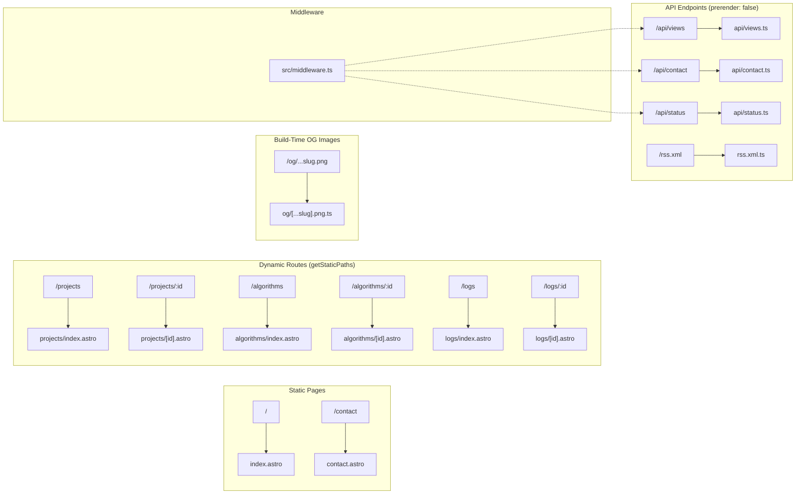

# Low-Level Design — Page Routing & API Contracts

## File-Based Routing Map



## Dynamic Route Patterns

### `src/pages/projects/[id].astro`

```astro
---
import { getCollection, render } from 'astro:content';
import ProjectLayout from '../../layouts/ProjectLayout.astro';

export async function getStaticPaths() {
  const projects = await getCollection('projects');
  return projects.map((project) => ({
    params: { id: project.id },
    props: { project },
  }));
}

const { project } = Astro.props;
const { Content } = await render(project);
---
<ProjectLayout
  title={project.data.title}
  description={project.data.description}
>
  <Content />
</ProjectLayout>
```

> **Astro 5 note:** Uses `project.id` (NOT `project.slug` — deprecated).

---

## API Route Contracts

### `POST /api/views`

**Purpose:** Increment page view counter in Appwrite.

```typescript
// src/pages/api/views.ts
import type { APIRoute } from 'astro';
import { z } from 'astro/zod';
import { createAppwrite, ID } from '../../lib/appwrite';
import { json } from '../../lib/api-utils';
import { Query } from 'node-appwrite';

export const prerender = false;

/** Validate slug format: lowercase alphanumeric, hyphens, slashes. Max 200 chars. */
const SlugParam = z.string()
  .min(1)
  .max(200)
  .regex(/^[a-z0-9][a-z0-9\-\/]*$/, 'Invalid slug format');

export const GET: APIRoute = async (context) => {
  const rawSlug = context.url.searchParams.get('slug');
  const parsed = SlugParam.safeParse(rawSlug);
  if (!parsed.success) return json({ error: 'Invalid slug parameter' }, 400);
  // ... read from Appwrite
};

export const POST: APIRoute = async (context) => {
  // Parse body, validate slug with SlugParam, upsert in Appwrite
  // ...
};
```

| Field | Details |
|---|---|
| Methods | `GET` (read count), `POST` (increment) |
| Content-Type | `application/json` |
| GET Params | `?slug=vault-ledger` |
| POST Body | `{ "slug": "vault-ledger" }` |
| Success Response | `200 { "views": 42 }` |
| Error (validation) | `400 { "error": "Invalid slug parameter" }` |
| CSRF | Origin validation via `src/middleware.ts` (POST only) |

---

### `POST /api/contact`

**Purpose:** Submit contact form to Appwrite ContactMessages table.

| Field | Details |
|---|---|
| Method | `POST` |
| Content-Type | `application/json` |
| Request Body | `{ "name": "string", "email": "string", "message": "string" }` |
| Success Response | `200 { "ok": true }` |
| Validation Error | `422 { "error": "Name must be at least 2 characters" }` |
| Parse Error | `400 { "error": "Invalid JSON body" }` |
| Rate Limit | Cloudflare WAF: 5 req/10min per IP |
| CSRF | Origin validation via `src/middleware.ts` |

```typescript
export const prerender = false;

const ContactPayload = z.object({
  name: z.string().min(2, 'Name must be at least 2 characters').max(100),
  email: z.string().email('Invalid email address'),
  message: z.string().min(10, 'Message must be at least 10 characters').max(1000),
});
```

---

### `GET /api/status`

**Purpose:** Read current live status message from Appwrite LiveStatus table.

| Field | Details |
|---|---|
| Method | `GET` |
| Content-Type | `application/json` |
| Success Response | `200 { "status": "Building distributed systems", "emoji": "++" }` |
| Fallback | Returns default status if Appwrite is down or unconfigured |
| Cache | `public, max-age=60, stale-while-revalidate=300` |

---

### `GET /rss.xml`

**Purpose:** RSS feed of engineering logs for subscriber consumption.

| Field | Details |
|---|---|
| Method | `GET` |
| Content-Type | `application/xml` |
| Response | RSS 2.0 XML with latest 50 log entries |
| Cache | Static (regenerated on each build) |
