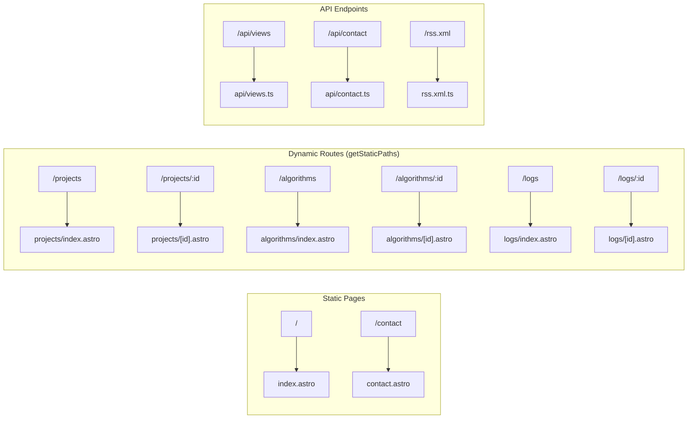

# Low-Level Design — Page Routing & API Contracts

## File-Based Routing Map



## Dynamic Route Patterns

### `src/pages/projects/[id].astro`

```astro
---
import { getCollection, render } from 'astro:content';
import ProjectLayout from '../../layouts/ProjectLayout.astro';

export async function getStaticPaths() {
  const projects = await getCollection('projects');
  return projects.map((project) => ({
    params: { id: project.id },
    props: { project },
  }));
}

const { project } = Astro.props;
const { Content } = await render(project);
---
<ProjectLayout
  title={project.data.title}
  description={project.data.description}
>
  <Content />
</ProjectLayout>
```

> **Astro 5 note:** Uses `project.id` (NOT `project.slug` — deprecated).

---

## API Route Contracts

### `POST /api/views`

**Purpose:** Increment page view counter in Appwrite.

```typescript
// src/pages/api/views.ts
import type { APIRoute } from 'astro';
import { z } from 'astro/zod';
import { databases, DB_ID } from '../../lib/appwrite';
import { ID, Query } from 'appwrite';

// ⚠️ REQUIRED: This endpoint runs at request-time, not build-time
export const prerender = false;

const VIEWS_TABLE = import.meta.env.PUBLIC_APPWRITE_VIEWS_TABLE_ID;

const ViewsInput = z.object({
  slug: z.string().min(1).max(200),
});

export const POST: APIRoute = async ({ request }) => {
  try {
    const body = await request.json();
    const { slug } = ViewsInput.parse(body);

    let views: number;
    try {
      // Try to find existing row
      const existing = await databases.listDocuments(DB_ID, VIEWS_TABLE, [
        Query.equal('slug', slug),
        Query.limit(1),
      ]);

      if (existing.documents.length > 0) {
        const doc = existing.documents[0];
        views = doc.views + 1;
        await databases.updateDocument(DB_ID, VIEWS_TABLE, doc.$id, { views });
      } else {
        views = 1;
        await databases.createDocument(DB_ID, VIEWS_TABLE, ID.unique(), { slug, views });
      }
    } catch {
      views = 0; // Appwrite down — fail gracefully
    }

    return new Response(JSON.stringify({ slug, views }), {
      status: 200,
      headers: {
        'Content-Type': 'application/json',
        'Access-Control-Allow-Origin': 'https://harshit.systems',
      },
    });
  } catch (error) {
    if (error instanceof z.ZodError) {
      return new Response(JSON.stringify({ error: 'Invalid input' }), { status: 400 });
    }
    return new Response(JSON.stringify({ error: 'Internal error' }), { status: 500 });
  }
};

// CORS preflight for client-side Appwrite SDK calls
export const OPTIONS: APIRoute = async () => {
  return new Response(null, {
    status: 204,
    headers: {
      'Access-Control-Allow-Origin': 'https://harshit.systems',
      'Access-Control-Allow-Methods': 'POST, OPTIONS',
      'Access-Control-Allow-Headers': 'Content-Type',
    },
  });
};
```

| Field | Details |
|---|---|
| Method | `POST` |
| Content-Type | `application/json` |
| Request Body | `{ "slug": "vault-ledger" }` |
| Success Response | `200 { "slug": "vault-ledger", "views": 42 }` |
| Error (validation) | `400 { "error": "Invalid input" }` |
| Error (server) | `500 { "error": "Internal error" }` |
| CORS | `https://harshit.systems` only |

---

### `POST /api/contact`

**Purpose:** Submit contact form to Appwrite ContactMessages table.

| Field | Details |
|---|---|
| Method | `POST` |
| Content-Type | `application/json` |
| Request Body | `{ "name": "string", "email": "string", "message": "string" }` |
| Success Response | `200 { "success": true }` |
| Validation Error | `400 { "error": "Invalid input", "details": [...] }` |
| Rate Limit | Cloudflare WAF: 5 req/min per IP on this endpoint |

```typescript
export const prerender = false;

const ContactInput = z.object({
  name: z.string().min(2).max(100).trim(),
  email: z.string().email().toLowerCase(),
  message: z.string().min(10).max(1000).trim(),
  idempotencyKey: z.string().uuid(), // Client-generated, prevents duplicate submissions
});
```

---

### `GET /rss.xml`

**Purpose:** RSS feed of engineering logs for subscriber consumption.

| Field | Details |
|---|---|
| Method | `GET` |
| Content-Type | `application/xml` |
| Response | RSS 2.0 XML with latest 50 log entries |
| Cache | Static (regenerated on each build) |
