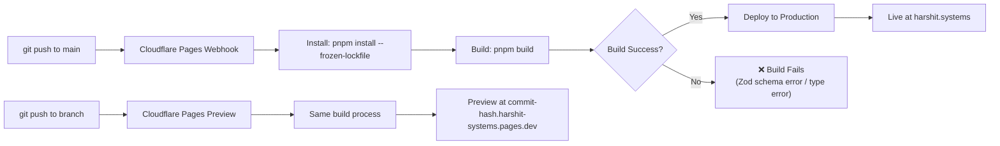

# LLD/06 — Deployment Specification (Infrastructure as Code)

## wrangler.toml

```toml
# wrangler.toml — Cloudflare Pages + Workers configuration
# Docs: https://developers.cloudflare.com/pages/functions/wrangler-configuration/

name = "harshit-systems"
pages_build_output_dir = "./dist"
compatibility_date = "2025-01-01"
compatibility_flags = ["nodejs_compat"]

# ─── Environment Variables (Non-Secret) ────────────────────────
[vars]
PUBLIC_APPWRITE_ENDPOINT = "https://cloud.appwrite.io/v1"
PUBLIC_APPWRITE_PROJECT_ID = "YOUR_PROJECT_ID"
PUBLIC_APPWRITE_DB_ID = "YOUR_DB_ID"
PUBLIC_APPWRITE_VIEWS_TABLE_ID = "YOUR_VIEWS_TABLE_ID"
PUBLIC_APPWRITE_CONTACT_TABLE_ID = "YOUR_CONTACT_TABLE_ID"
SITE_URL = "https://harshit.systems"

# ─── Production Overrides ──────────────────────────────────────
[env.production.vars]
PUBLIC_APPWRITE_ENDPOINT = "https://cloud.appwrite.io/v1"

# ─── Preview/Staging Overrides ─────────────────────────────────
[env.preview.vars]
PUBLIC_APPWRITE_ENDPOINT = "https://cloud.appwrite.io/v1"
SITE_URL = "https://preview.harshit-systems.pages.dev"
```

> **Secrets:** Appwrite API keys (if any server-side keys are added later) must be set via `wrangler secret put KEY_NAME` or the Cloudflare dashboard. **Never in `wrangler.toml`.**

## Astro Config (Updated)

```javascript
// astro.config.mjs
import { defineConfig } from 'astro/config';
import cloudflare from '@astrojs/cloudflare';
import tailwindcss from '@tailwindcss/vite';
import preact from '@astrojs/preact';
import sitemap from '@astrojs/sitemap';

export default defineConfig({
  site: 'https://harshit.systems',
  adapter: cloudflare({
    // Enable local simulation of Cloudflare bindings
    platformProxy: {
      enabled: true,
      configPath: './wrangler.toml',
    },
  }),
  integrations: [preact(), sitemap()],
  vite: {
    plugins: [tailwindcss()],
  },
});
```

## TypeScript Env Types

```typescript
// src/env.d.ts — Auto-generated via `wrangler types`
interface Env {
  PUBLIC_APPWRITE_ENDPOINT: string;
  PUBLIC_APPWRITE_PROJECT_ID: string;
  PUBLIC_APPWRITE_DB_ID: string;
  PUBLIC_APPWRITE_VIEWS_TABLE_ID: string;
  PUBLIC_APPWRITE_CONTACT_TABLE_ID: string;
  SITE_URL: string;
}
```

## package.json Scripts

```json
{
  "scripts": {
    "dev": "astro dev",
    "build": "astro build",
    "preview": "wrangler pages dev ./dist",
    "check": "astro check",
    "sync": "astro sync",
    "types": "wrangler types",
    "deploy": "pnpm build && wrangler pages deploy ./dist"
  }
}
```

## CI/CD Pipeline (Cloudflare Pages Auto-Deploy)



## Build Configuration (Cloudflare Dashboard)

| Setting | Value |
|---|---|
| **Framework preset** | Astro |
| **Build command** | `pnpm build` |
| **Build output directory** | `dist` |
| **Root directory** | `/` |
| **Node.js version** | `20` |
| **Package manager** | `pnpm` (auto-detected) |
| **Environment variables** | Set via `wrangler.toml` `[vars]` or dashboard |

## Runtime Constraints (Free Tier)

| Resource | Limit | Our Usage |
|---|---|---|
| Builds/month | 500 | ~60 (2/day avg) |
| Concurrent builds | 1 | 1 |
| Worker invocations/day | 100,000 | ~500 (view + contact API) |
| Worker CPU time/invocation | 10ms | ~2ms (lightweight upsert) |
| Worker size | 1 MB | ~200KB (Appwrite SDK) |
| Sites | Unlimited | 1 |
| Bandwidth | Unlimited | ✅ |
| Custom domains | 100 | ~5 (subdomains) |

## Required Files in Repository Root

| File | Purpose | In `.gitignore`? |
|---|---|---|
| `wrangler.toml` | Cloudflare config + env vars | ❌ No (tracked) |
| `astro.config.mjs` | Astro + integrations + adapter | ❌ No |
| `pnpm-lock.yaml` | Dependency lock | ❌ No |
| `.dev.vars` | Local-only secrets (if any) | ✅ Yes |
| `tsconfig.json` | TS config (extends `astro/tsconfigs/strict`) | ❌ No |
