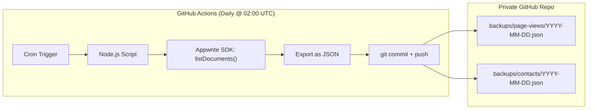

# LLD/07 — Disaster Recovery (Appwrite Backup)

## The Risk

| Data Source | Backup Method | Current Status |
|---|---|---|
| Markdown content | Git (distributed) | ✅ Backed up |
| Design tokens / CSS | Git | ✅ Backed up |
| Configuration | Git (`wrangler.toml`, `astro.config.mjs`) | ✅ Backed up |
| **Page views** | Appwrite Cloud only | ❌ **No backup** |
| **Contact messages** | Appwrite Cloud only | ❌ **No backup** |

If the Appwrite Student account is suspended, rate-limited, or corrupted, **all page view history and contact messages are lost.**

## The Solution: GitHub Actions Cron Backup



## GitHub Actions Workflow

```yaml
# .github/workflows/appwrite-backup.yml
name: Appwrite Data Backup

on:
  schedule:
    - cron: '0 2 * * *'  # Daily at 02:00 UTC
  workflow_dispatch:        # Manual trigger

permissions:
  contents: write  # Allow git push

jobs:
  backup:
    runs-on: ubuntu-latest
    steps:
      - uses: actions/checkout@v4

      - uses: pnpm/action-setup@v4
        with:
          version: 9

      - uses: actions/setup-node@v4
        with:
          node-version: 20
          cache: pnpm

      - run: pnpm install --frozen-lockfile

      - name: Run backup script
        env:
          APPWRITE_ENDPOINT: ${{ secrets.APPWRITE_ENDPOINT }}
          APPWRITE_PROJECT_ID: ${{ secrets.APPWRITE_PROJECT_ID }}
          APPWRITE_API_KEY: ${{ secrets.APPWRITE_API_KEY }}
          APPWRITE_DB_ID: ${{ secrets.APPWRITE_DB_ID }}
          VIEWS_TABLE_ID: ${{ secrets.APPWRITE_VIEWS_TABLE_ID }}
          CONTACT_TABLE_ID: ${{ secrets.APPWRITE_CONTACT_TABLE_ID }}
        run: node scripts/backup-appwrite.mjs

      - name: Commit and push backups
        run: |
          git config user.name "github-actions[bot]"
          git config user.email "github-actions[bot]@users.noreply.github.com"
          git add backups/
          git diff --cached --quiet || git commit -m "chore: daily Appwrite backup $(date -u +%Y-%m-%d)"
          git push
```

## Backup Script

```javascript
// scripts/backup-appwrite.mjs
import { Client, Databases, Query } from 'node-appwrite';
import { writeFileSync, mkdirSync } from 'node:fs';

const client = new Client()
  .setEndpoint(process.env.APPWRITE_ENDPOINT)
  .setProject(process.env.APPWRITE_PROJECT_ID)
  .setKey(process.env.APPWRITE_API_KEY);  // Server-side API key (not PUBLIC_)

const databases = new Databases(client);
const DB_ID = process.env.APPWRITE_DB_ID;

const today = new Date().toISOString().split('T')[0]; // YYYY-MM-DD

async function exportTable(tableId, name) {
  const allDocs = [];
  let offset = 0;
  const limit = 100;

  // Paginate through all documents
  while (true) {
    const response = await databases.listDocuments(DB_ID, tableId, [
      Query.limit(limit),
      Query.offset(offset),
    ]);
    allDocs.push(...response.documents);
    if (response.documents.length < limit) break;
    offset += limit;
  }

  const dir = `backups/${name}`;
  mkdirSync(dir, { recursive: true });
  writeFileSync(
    `${dir}/${today}.json`,
    JSON.stringify(allDocs, null, 2),
  );
  console.log(`✅ ${name}: ${allDocs.length} documents backed up`);
}

await exportTable(process.env.VIEWS_TABLE_ID, 'page-views');
await exportTable(process.env.CONTACT_TABLE_ID, 'contacts');
```

## Recovery Plan

| Scenario | Action | RTO | RPO |
|---|---|---|---|
| Appwrite down temporarily | Views/contact fail gracefully (static pages unaffected) | 0 min | 0 (no data loss, just unavailable) |
| Appwrite data corrupted | Restore from latest JSON backup in `backups/` | ~30 min | 24 hours (daily backup) |
| Student account suspended | Create new project, import JSON backups | ~1 hour | 24 hours |
| Need to migrate to Supabase/self-hosted | Transform JSON → new DB schema, import | ~2 hours | 24 hours |

## Recovery Script

```javascript
// scripts/restore-appwrite.mjs
// Usage: node scripts/restore-appwrite.mjs --table page-views --date 2026-02-22
import { Client, Databases, ID } from 'node-appwrite';
import { readFileSync } from 'node:fs';

const [, , , tableName, , date] = process.argv;
const backup = JSON.parse(
  readFileSync(`backups/${tableName}/${date}.json`, 'utf-8'),
);

// ... create each document in new Appwrite project
for (const doc of backup) {
  const { $id, $createdAt, $updatedAt, $databaseId, $collectionId, ...data } = doc;
  await databases.createDocument(DB_ID, TABLE_ID, ID.unique(), data);
}
```

## Backup Directory Structure

```
backups/
├── page-views/
│   ├── 2026-02-22.json    # [{ slug: "/projects/vault-ledger", views: 42 }, ...]
│   ├── 2026-02-23.json
│   └── ...
├── contacts/
│   ├── 2026-02-22.json    # [{ name: "...", email: "...", message: "..." }, ...]
│   └── ...
└── .gitkeep
```

## Retention Policy

| Metric | Value |
|---|---|
| Backup frequency | Daily (02:00 UTC) |
| Retention | Last 90 days (prune older via separate cron) |
| Storage | Same GitHub repo (`backups/` directory) |
| Encryption | GitHub repo is private; Appwrite API key in GitHub Secrets |
